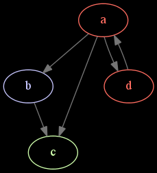
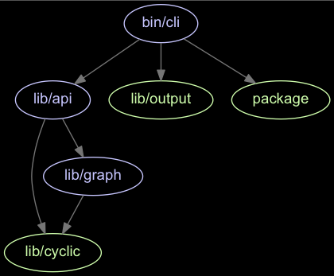

# MaDGe - Module Dependency Graph

A tool for generating a visual graph from your module dependencies. Can also find circular dependencies and give you other useful info about your dependencies. The dependencies are generated using Joel Kemp's awesome [dependency-tree](https://github.com/mrjoelkemp/node-dependency-tree).

Works for JS (AMD, CommonJS, ES6 modules) and CSS preprocessors (Sass, Stylus); basically, any filetype supported by [precinct](https://github.com/mrjoelkemp/node-precinct).

  - For CommonJS modules, 3rd party dependencies (npm installed dependencies) are exluded in the tree
  - Dependency path resolutions are handled by [filing-cabinet](https://github.com/mrjoelkemp/node-filing-cabinet)
  - Supports RequireJS and Webpack loaders
  - All core Node modules (assert, path, fs, etc) are removed from the dependency list by default

See [CHANGELOG](CHANGELOG.md) for latest changes.

## Examples
Here's a very simple example of a generated image.

 - blue = has dependencies
 - green = has no dependencies
 - red = has circular dependencies

Here's an example generated from the madge source using the command `madge bin/cli.js --directory . --image examples/madge.png`.

# Installation

	$ npm -g install madge

## Graphviz (optional)

> Only required if you want to generate the visual graphs using [Graphviz](http://www.graphviz.org/).

### Mac OS X

	$ brew install graphviz || port install graphviz

### Ubuntu

	$ apt-get install graphviz

# API

## madge(filePath: string, config: object)

> `config` is optional and should be [configuration](#configuration) to be used.

Returns a `Promise` resolved with the Madge instance object.

## Functions

#### .obj()

> Returns an `Object` with all dependencies.

	const madge = require('madge');

	madge('path/to/app.js').then((res) => {
		console.log(res.obj());
	});

#### .circular()

> Returns an `Array` with all modules that has circular dependencies.

	const madge = require('madge');

	madge('path/to/app.js').then((res) => {
		console.log(res.circular());
	});

#### .depends()

> Returns an `Array` with all modules that depends on a given module.

	const madge = require('madge');

	madge('path/to/app.js').then((res) => {
		console.log(res.depends());
	});

#### .dot()

> Returns a `Promise` resolved with a DOT representation of the module dependency graph.

	const madge = require('madge');

	madge('path/to/app.js')
		.then((res) => res.dot())
		.then((output) => {
			console.log(output;
		});

#### .image(imagePath: string)

> Write the graph as an image to the given image path. The [image format](http://www.graphviz.org/content/output-formats) to use is determined from the file extension. Returns a `Promise`.

	const madge = require('madge');

	madge('path/to/app.js')
		.then((res) => res.image('path/to/image.svg'))
	});

# Configuration

Property | Type | Default | Description
--- | --- | --- | ---
`includeNpm` | Boolean | false | If node_modules should be included
`showFileExtension` | Boolean | false | If file extensions should be included in module name
`requireConfig` | String | null | RequireJS config for resolving aliased modules
`webpackConfig` | String | null | Webpack config for resolving aliased modules
`layout` | String | dot | Layout to use in graph
`fontName` | String | Arial | Font name to use in graph
`fontSize` | String | 14px | Font size  to use in graph
`backgroundColor` | String | #000000 | Background color for the graph
`nodeColor` | String | #c6c5fe | The default node color to use in the graph
`noDependencyColor` | String | #cfffac | The color to use for nodes with no dependencies
`cyclicNodeColor` | String | #ff6c60 | The color to used for circular dependencies
`edgeColor` | String | #757575 | The edge color to use in the graph

> Note that when running the CLI it's possible to use a runtime configuration file. The config should placed in `.madgerc` in your project or home folder. Look [here](https://github.com/dominictarr/rc#standards) for alternative locations for the file. Here's an example:

	{
		"showFileExtension": true,
		"fontSize": "10px"
	}

# CLI

## Examples

> List all module dependencies

	$ madge path/src/app.js

> Finding circular dependencies

	$ madge --circular path/src/app.js

> Show modules that depends on a given module

	$ madge --depends 'wheels' path/src/app.js

> Excluding modules

	$ madge --exclude '^foo$|^bar$|^tests' path/src/app.js

> Save graph as a PNG image (graphviz required)

	$ madge --image graph.png path/src/app.js

> Save graph as a [DOT](http://en.wikipedia.org/wiki/DOT_language) file for further processing (graphviz required)

	$ madge --dot path/src/app.js > graph.gv

# Debugging

> To enable debugging output if you encounter problems, run madge in the following way

	$ DEBUG=* madge path/src/app.js

# Running tests

	$ npm test

# FAQ

## What's the "Error: write EPIPE" when exporting graph to image?

Ensure you have Graphviz installed. And if you're running Windows graphviz is not setting PATH variable during install. You should add folder of gvpr.exe (typically %Graphviz_folder%/bin) to PATH variable.

## The image produced by madge is very hard to read, what's wrong?

Try running madge with a different layout, here's a list of the ones you can try:

* **dot**	"hierarchical" or layered drawings of directed graphs. This is the default tool to use if edges have directionality.

* **neato** "spring model'' layouts.  This is the default tool to use if the graph is not too large (about 100 nodes) and you don't know anything else about it. Neato attempts to
minimize a global energy function, which is equivalent to statistical multi-dimensional scaling.

* **fdp**	"spring model'' layouts similar to those of neato, but does this by reducing forces rather than working with energy.

* **sfdp** multiscale version of fdp for the layout of large graphs.

* **twopi** radial layouts, after Graham Wills 97. Nodes are placed on concentric circles depending their distance from a given root node.

* **circo** circular layout, after Six and Tollis 99, Kauffman and Wiese 02. This is suitable for certain diagrams of multiple cyclic structures, such as certain telecommunications networks.

# License

MIT License